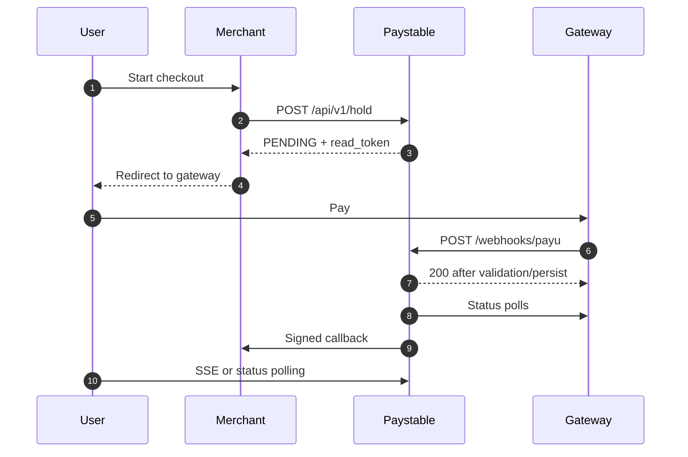

Paystable is a payment state stabilizer. Use it when your app already has a gateway integration but needs safer handling for webhook lag, duplicated events, missing callbacks, stale status APIs, and amount mismatches.

It is not a payment gateway or payment router. Paystable starts after the user begins checkout and ends when your backend receives a signed final-state callback.

## Install

```bash
curl -fsSL https://paystable.vercel.app | sh
cd paystable
# edit .env
./paystable
```

The installer downloads the latest GitHub release for your OS/arch and verifies the binary against `checksums.txt`.

The embedded dashboard is available at:

```text
http://localhost:8080/dashboard
```

Admin routes are loopback-only. Do not expose the dashboard directly to the public internet.

## Configure

Required environment variables:

| Variable | Purpose |
|---|---|
| `DATABASE_URL` | PostgreSQL connection string. |
| `GATEWAY` | Current adapter, normally `payu`. |
| `WEBHOOK_SECRET` | Gateway webhook signing secret. For PayU this is the salt. |
| `GATEWAY_API_KEY` | Gateway credential. For PayU this is the merchant key. |
| `PAYU_STATUS_URL` | PayU status API endpoint. |
| `MERCHANT_CALLBACK_SECRET` | Secret used to sign callbacks to your app. |
| `ADMIN_API_KEY` | Bearer token for hold creation and backend reads. |

Useful optional variables:

| Variable | Default | Purpose |
|---|---:|---|
| `PORT` | `8080` | HTTP port. |
| `STABILIZATION_N` | `3` | Matching completed polls required for terminal success/failure. |
| `HOLD_MAX_TTL_S` | `900` | Maximum accepted hold TTL. |
| `DELIVERY_TIMEOUT_S` | `10` | Merchant callback timeout. |
| `DELIVERY_ALLOW_INSECURE_CALLBACK` | `false` | Allows `http://` callbacks in local dev only. |
| `SECRET_ENCRYPTION_KEY` | empty | Required for encrypted webhook secret rotation. |

## Integration Flow



## Create a Hold

```http
POST /api/v1/hold
Authorization: Bearer <ADMIN_API_KEY>
Content-Type: application/json
```

```json
{
  "txn_id": "order_abc123",
  "gateway": "payu",
  "amount": 49900,
  "currency": "INR",
  "ttl_seconds": 300,
  "callback_url": "https://merchant.example/paystable/callback",
  "metadata": {
    "order_id": "order_abc123"
  }
}
```

Response:

```json
{
  "txn_id": "order_abc123",
  "status": "PENDING",
  "read_token": "pst_rt_...",
  "expires_at": "2026-06-24T12:05:00Z",
  "created_at": "2026-06-24T12:00:00Z"
}
```

The `amount` is in the smallest currency unit. For INR, `49900` means Rs 499.00.

## Point Gateway Webhooks at Paystable

Use:

```http
POST https://<paystable-host>/webhooks/payu
```

Paystable verifies the gateway signature. Valid webhooks are stored in `webhooks`. Rejected webhooks are stored in `webhooks_rejected`.

## Read Status from the Frontend

```http
GET /api/v1/transactions/{txn_id}/status?token={read_token}
GET /api/v1/transactions/{txn_id}/stream?token={read_token}
```

Frontend reads are for display only. Fulfillment should happen from the backend callback.

## Fulfill from Callback

Paystable calls the hold `callback_url` when the hold reaches a final state:

```http
POST <callback_url>
X-Paystable-Signature: sha256=<hmac>
X-Paystable-Idempotency-Key: <opaque-key>
X-Paystable-Timestamp: <unix-seconds>
```

Always verify the signature and deduplicate by idempotency key before fulfilling.

See [Callback Contract](/reference/callbacks/) for the full payload and retry behavior.

## Local Testkit

```bash
cp .env.testkit.example .env.testkit
docker compose -f docker-compose.testkit.yml --env-file .env.testkit up --build
```

Available services:

| Service | URL |
|---|---|
| Paystable | `http://localhost:8080` |
| Mock gateway | `http://localhost:9090` |
| Mock merchant | `http://localhost:9091` |
